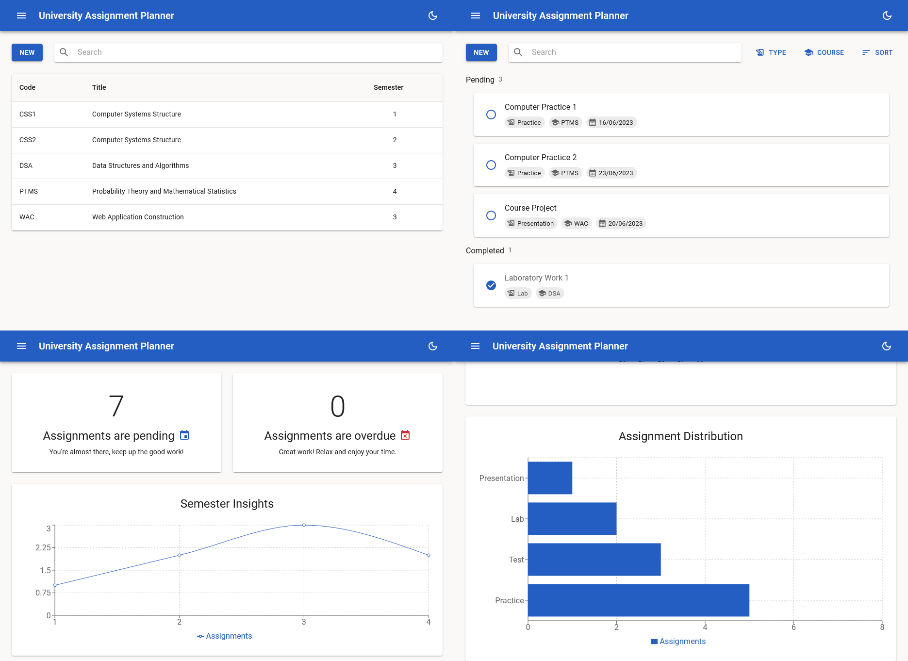

# University Assignment Planner

A small and simple university assignment planner for students! 🎓



## Features

- Full-stack CRUD application.
- RESTful API and PostgreSQL database.
- UI and UX based on Google's [Material Design](https://m3.material.io/)
- Contains charts and calendars.
- Supports dark and light themes.

## Technologies

The backend makes use of the following modules:

- [Spring Boot](https://spring.io/projects/spring-boot)
- [Spring Data JPA](https://spring.io/projects/spring-data-jpa)
- Spring Boot Validation
- Spring Boot Test
- [Lombok](https://projectlombok.org/)

The frontend makes use of the following modules:

- [React](https://react.dev/)
- [React Router](https://reactrouter.com/en/main)
- [React Query](https://tanstack.com/query/v3/)
- [MUI](https://mui.com/)
- [Recharts](https://recharts.org/en-US/)
- [Formik](https://formik.org/)
- [Yup](https://github.com/jquense/yup)
- [Axios](https://axios-http.com/docs/intro)
- [DayJS](https://day.js.org/)

## Building

To build and run this project locally, you will need the following:

- [Docker](https://www.docker.com/)
- [Node.js](https://nodejs.org/en) and [npm](https://www.npmjs.com/)
- Java 17 SDK

Before proceeding with the build process, ensure that the path to your Java SDK is set via the `JAVA_HOME` environment
variable. Additionally, consider using [Docker Desktop](https://www.docker.com/products/docker-desktop/) to run Docker
containers.

Firstly, start the PostgreSQL database in a container using [Docker Compose](https://docs.docker.com/compose/) (ensure
that Docker is running beforehand). Make sure you are in the `server` directory and execute the following:

```sh
docker-compose up
```

Next, build and run the Spring Boot application using `mvnw` (you may need to do this from a different terminal window
than the one where Docker Compose is running). Make sure you are in the `server` directory and execute the following:

```sh
# If you are on Windows.
.\mvnw.cmd clean install
.\mvnw.cmd spring-boot:run

# If you are on Mac or Linux.
./mvnw clean install
./mvnw spring-boot:run
```

At this point, the backend should be up and listening on port `8080`. You may verify this by running a `GET` request
to any of the available endpoints, such as `localhost:8080/api/v1/assignments`. At this point, it should return
an empty response.

Finally, you need to start the React application using `npm`. Make sure you are in the `client` directory and execute
the following (again, you may need a new terminal window for this):

```sh
npm install
npm start
```

At this point, the website should be running on port `3000`. Navigate to `localhost:3000/assignments` to try it out!
